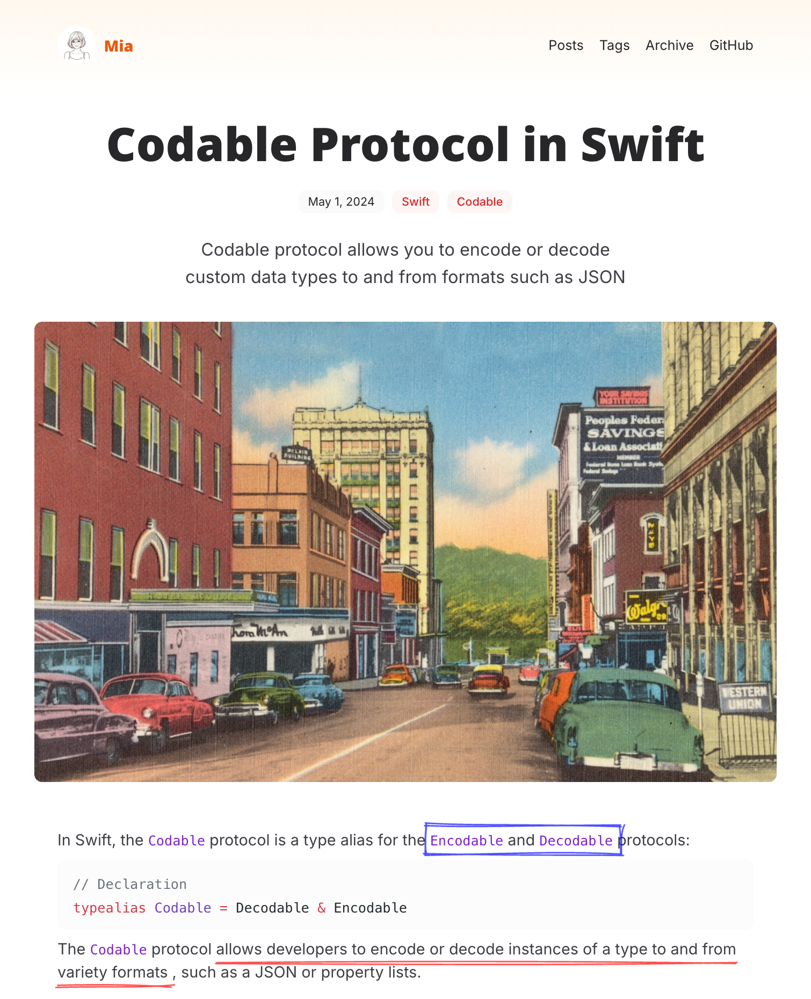

import { Image } from 'astro:assets';

我把博客系统从原来的 [Hugo](https://gohugo.io/) 换成了 [Astro](https://astro.build/)。

## 动机

起因是我在 B 站偶然刷到 up 主 [polebug23](https://space.bilibili.com/58078997) 的学习 vlog：

<iframe src="//player.bilibili.com/player.html?isOutside=true&aid=113617974335402&bvid=BV19fqpYHELi&cid=25727212844&p=1&autoPlay=0" scrolling="no" border="0" frameborder="no" framespacing="0" allowfullscreen="true" height="400"></iframe>

她把学的东西都表达了一遍。根据我多年的体会，只输入不输出的学习枯燥无比；但带一点输出时，会让学习的过程变得愉悦。

最近我打算写多一点代码，比如深入体验下 Supabase 方方面面的功能。我想把探索的过程纪录下来，写成一个 Devlog 系列。因此这次改造博客系统的最大需求是，期望能根据分类来聚合一批内容。

## 为什么不继续用 Hugo？

原本用的博客系统是 [Hugo](https://gohugo.io/)，主题是 [PaperMod](https://github.com/adityatelange/hugo-PaperMod)。对于 PaperMod 我是满意的，它足够简洁美观；对它的排版做了一番改造后，也已经符合我的审美。

问题出在 Hugo 上。Hugo 的 [模板语言](https://gohugo.io/templates/introduction/) 很难让人喜欢，它跟 go 的 text/template 一样的隐晦和丑陋。它的 [文档](https://gohugo.io/documentation/) 有一股浓烈的程序员风格，满屏都是看起来很高级的机制；但作为内容创作者，我只想知道它能如何帮我组织内容、写出东西，而不是这个那个的高级玩意。

当初使用 Hugo 替换 Jekyll，是因为 Jekyll 的配置和构建效率都让我不满，而 Hugo 快得多。但现在 JS 世界有了 Vite，JS 的工具在构建性能上也不输 Hugo 了。因此我的目光转向了 JS 世界。

## 为什么用 Astro？

这并不是一个深思熟虑的选择。JS 的内容框架中，流行的有 Gatsby, Next.js 和 Astro。Astro 看起来是主力做内容站点的。

## 主题的选择

我预期将内容主要组织成几个分类：

- Devlog：做编程开发的纪录
- Readlog：读书或观影的内容纪录
- Lifelog：生活纪录

因此我需要一个主题，它可以按目录来展示内容，并且期望它足够简洁、排版足够好看。

第一个晚上折腾的主题是 [Astro Paper](https://github.com/satnaing/astro-paper)：


它足够简洁漂亮，code block、表格的样式都很漂亮。但是折腾起来遇到两个问题：

- 想在首页展示多个分类的最近文章时，代码并不是很好改
- 我并不太喜欢用 mono 字体作为主字体，它的可读性不如 sans。但是我将字段换成 Open Sans 时，主题整体的质感下降了很多

于是我继续找其他的选择。发现了 [Mia](https://astro-theme-mia.pages.dev/) 主题：



这渐变色的背景、胶片感的封面图、漂亮的配色，还有手写体的下划线功能，一下子把我吸引了。尝试搭了一个后，也发现一些问题。

**段落间的间距不够**，导致当段落比较长时阅读压力很大。我做了一些调整：

Before:


After:


**首页的标题的字重太重**。它的 demo 页面中使用的是英文，笔划少看起来效果还行；但是一旦换成中文就感觉非常重。文章页中的字号也是对中文偏大的。

**响应式的支持不好**。在手机上看时，navbar 很容易很挤且折行；文章标题字号也偏大。在这里需要夸下 GitHub Copilot，帮我将 navbar 做了一个简陋但可行的响应式改造。它会在小屏幕上自动折成两行：

import headerImg from '../../../assets/images/2024/blog-responsive-header.png';

<Image src={headerImg} alt="The responsive header." width="400" densities={[1.5, 2]} />

做完这些改造后，它无论在大屏还是小屏上算是基本能看了。

## 使用 Obsidian 编写 Markdown

最后一环涉及到实际的编写体验。我认为 Obsidian 是现今体验最好的 Markdown 写作软件，而且已经把前浪 Typora 拍打在沙滩上。我的方案参考这个 [YouTube 视频](https://www.youtube.com/watch?v=dz3GOp4hN50)。

在分工上，不同的工具处理不同部分：

- 内容编写用 Obsidian
- 框架和样式用 VSCode

内容编写上，Obsidian 需要关心的是文章和其中的图片素材。因此我建了一个目录，只把这两部分目录软链进来：

```
assets -> ../blog2/src/assets
content -> ../blog2/src/content
```

然后在 Obsidian 中这样设置：


这样当你直接将一个图片粘贴进来时，Obsidian 生成的文本是这样的：

```

```

这种使用了相对路径且非 `[[Wikilinks]]` 格式的链接，是兼容 Astro 的。设置的 attachment folder path 则可以把图片放到合适的目录中。

此外还有一些插件可以极大地提升编辑体验：

- Addional Markdown suffix (.mdx/.svx)：让 Obsidian 可以将 MDX 文件直接当作 MD 来编辑
- Paste URL into selection：选中一段文字粘贴进 URL 时，会直接将它转成 Markdown 链接
- Paste image rename：粘贴图片进来时，自动弹出一个对话框让你改文件名；这样保存下来的文件不会是默认的 `Pasted Image xxx.png`
- Linter：这是最强的 Markdown 排版工具，可以配置非常细的排版规则，比如中英文间要有空格、链接的文本前后要有空格等等，然后支持保存时自动排版，非常非常好用

这样折腾一套下来，这个博客基本上是可用且方便的。未来会把重心放在写内容而不是折腾框架上。以上。