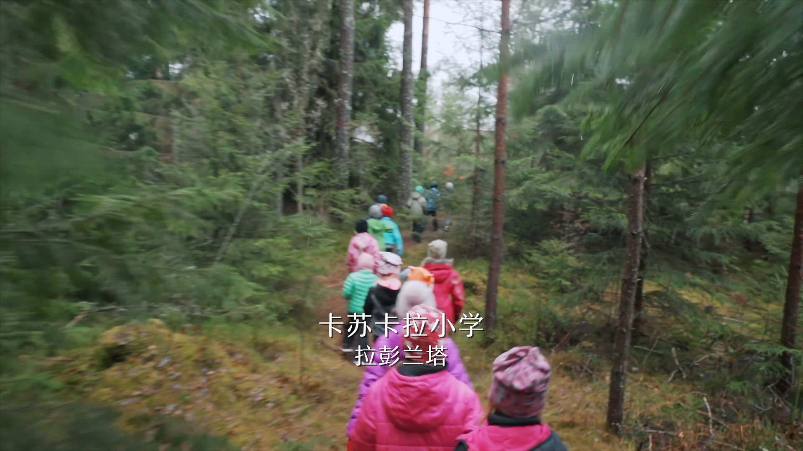
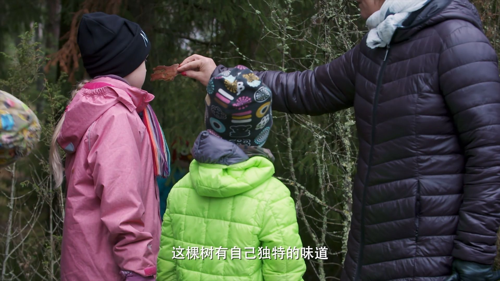
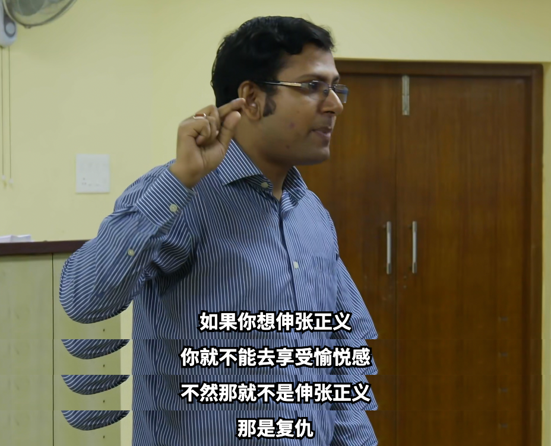
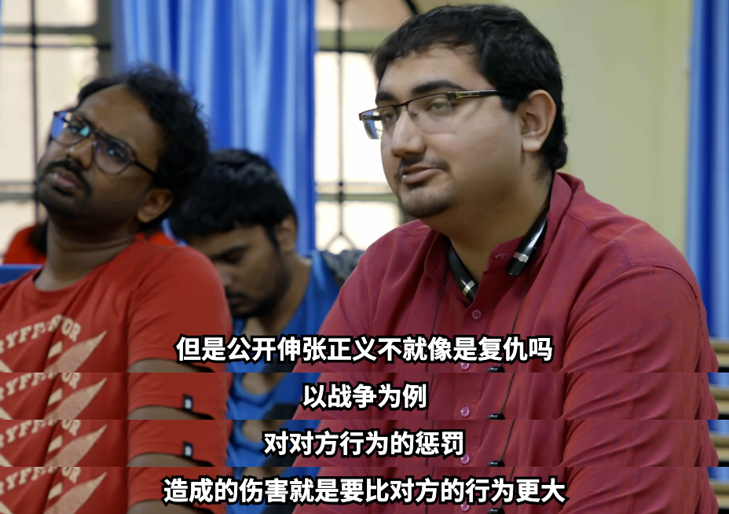

我的女儿四岁了。她慢慢长大，各种能力开始增强，我也不得不去思考要给她怎样的教育。偶然得知有一个纪录片叫《[他乡的童年](https://movie.douban.com/subject/34807388/)》，讲的是记者周轶君走访不同国家，去了解各地教育理念的故事。看了几集，对我有所启发，也纪录在这里。

## 芬兰

芬兰的特点是 **非常以学生为中心**。他们不提倡竞争，认为没有教不好的孩子，只有不会因材施教的老师。它们在小学阶段几乎没有正式的考试。

孩子们可以奇装异服：

也可以按自己舒服的方式阅读：

让我最羡慕的是，他们时常可以去户外上课。芬兰有着大片的森林🪵，学校会组织大家在自然中学习：

老师给每个人发了一张色卡，要求他们去收集不同颜色的材料：

去品尝大自然的味道：

还有这个手工课程，背景是你的飞机坠落在荒岛上，需要搭一个帐篷来生存。孩子们用不同材料搭出了很有创意的作品：

他们还组织小朋友到养老院，跟老人一起画画、交流，以提升他们对社会的责任感：

我自己所接受过的教育，从小学到大学，都让我觉得非常死板和无趣。我很难接受女儿的学习体验也跟我一样糟糕。芬兰的教育明显是我的理想型。这个社会对孩子个性有足够的尊重，不唯成绩论，待人平等、互相尊重。高福利社会又能支持学校设计很多有意思的课程。我女儿这种活泼好动、又充满好奇心的性格，应该会很喜欢这样的生活。

这几天娃幼儿园组织散学典礼，给所有宝宝都发了奖状。虽然每个人都有，但我还是从奖状内容中发现了小差异。我女儿属于调皮捣蛋型，在班里算不上传统意义上的 “好学生“，于是她的奖状上写的是 “进步之星”。别的孩子大体上是什么 “优秀宝贝” “可爱宝贝” “阅读小达人” 之类。我们的社会即使也在减少竞争，但骨子里头还是喜欢留着一套评价体系。(But I don't really care about this 就是了)

当然纪录片毕竟不是严谨的社会调查，肯定会带有一些滤镜。豆瓣上也有网友表示她的孩子在芬兰的学习体验 [并不如片中那样美好](https://movie.douban.com/subject/34807388/discussion/637448629/)。“老师真的没那么善解人意，这样的老师在哪里都是稀缺的。“ 这个我很认可。即使是真正喜欢小孩的人，每天身边围着几十个孩子，也很难保持长时间的热情吧。

我自己初高中的学习强度很低，我基本不听课靠自学。我不希望娃处在一个高压的学习环境，那样只会提早磨灭好奇心和学习的热情。希望她真正读书的时候，我有足够的能力能让她避开无意义的卷，早一些磨练各方面的技能，找到自己热爱的事情。

## 印度

为什么全球大型科技公司中，印度高管的比例这么高？这也许跟他们对待学问的方式有关。

印度跟中国非常不一样的点是，它不认为问题需要有一个标准答案，认为学校应该提供一个从多角度探讨问题的环境，甚至挑战老师也被是被推崇的：

片子里面提到一点，印度的课堂上经常有大量的讨论。印度学生热衷讨论，即使他的观点和思考都还不成熟，也仍然愿意把观点表达出来。感受下这段对话：

一样是人口大国，为什么我们会比印度更崇尚标准答案呢？

上面的例子是在大城市里的好学校。下面的故事是在一个穷困的乡村里。这里没有钱造好的学校，也没有钱请老师，他们想到的办法是利用网络来学习。小朋友们围坐在电脑前，每天都有志愿者远程给他们授课：

这样贫困的农村地区，他们的家长甚至连能联网的手机都没有，小孩子能接触的教育资源也少之又少。像这样一个互联网学校，甚至连网络都是一个难解的问题。但多亏了互联网，孩子们有了一扇看见世界的窗户。它们叫这个作「自我组织的学习环境」。

在我成长的环境，娱乐和学习的资源都是很匮乏的。我还记得小学时的暑假，真的是在家看了两个月的电视，无聊到甚至想早点开学。但现在的小孩们有太多娱乐的方式了。我担心在这样的环境下，孩子们很难对一个东西有真正的好奇心和热情。好玩的东西这么多，他们不会很想在一件事情上下很大的功夫。要怎样去激励孩子往好的方向走，可能是个大问题。
