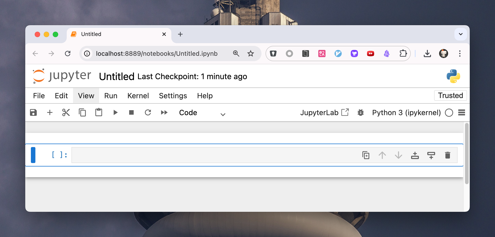
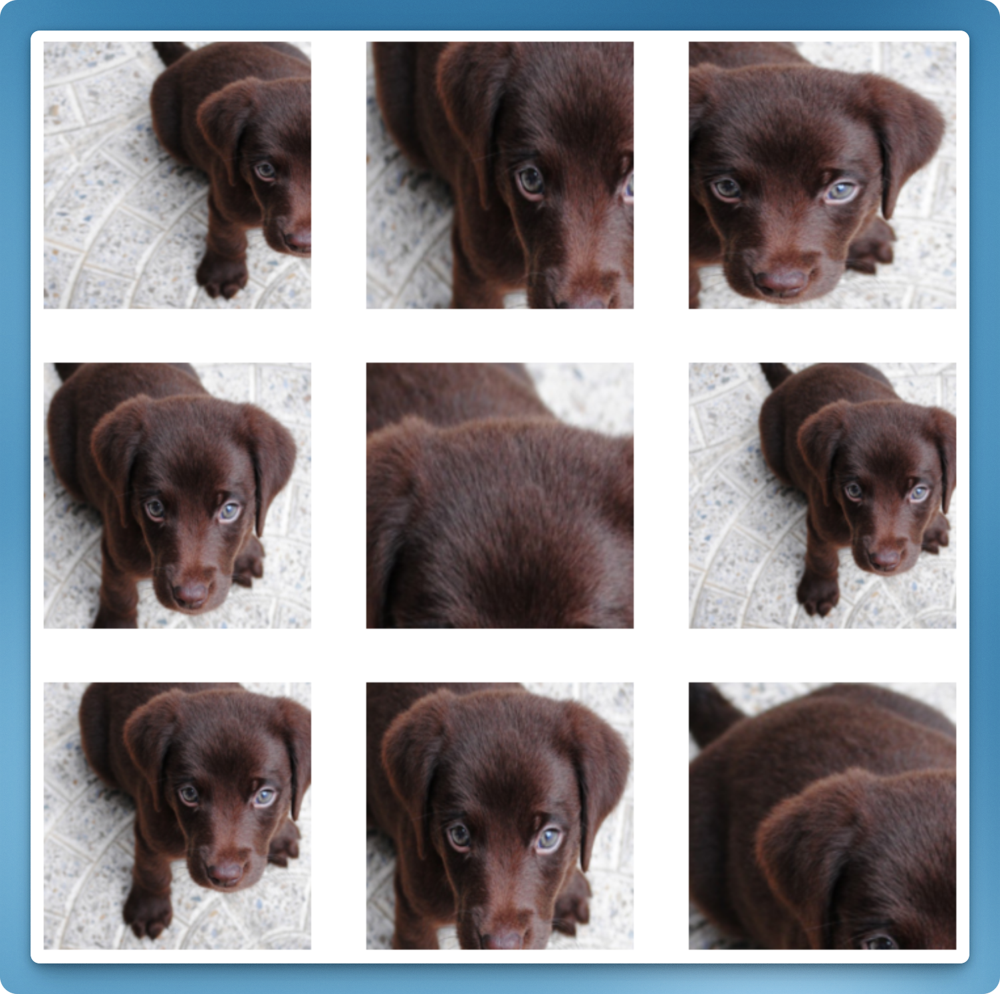
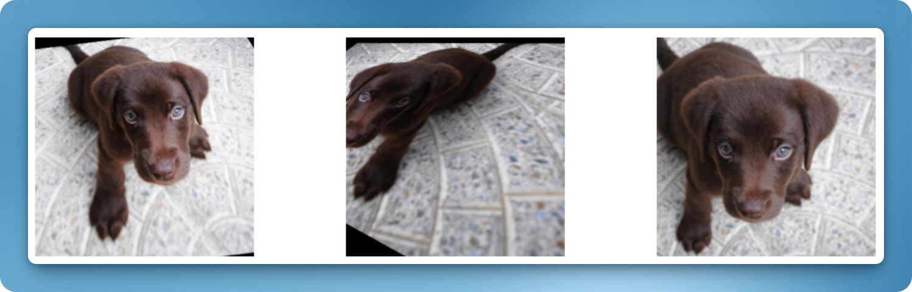
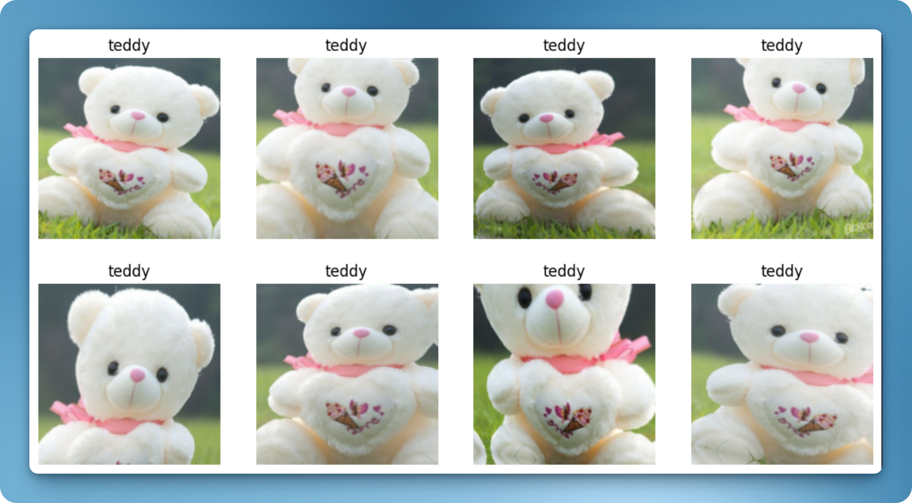
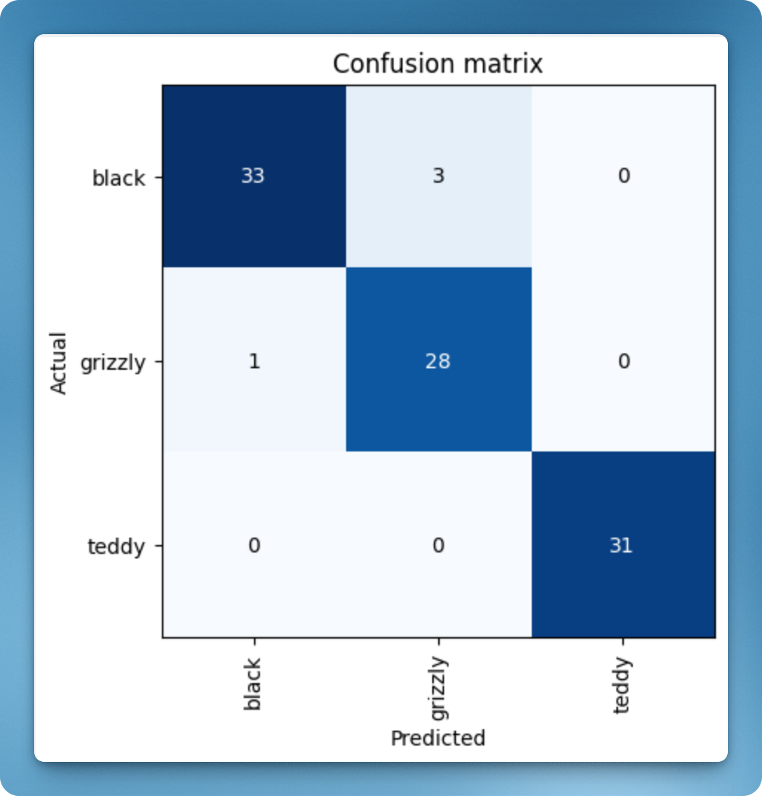
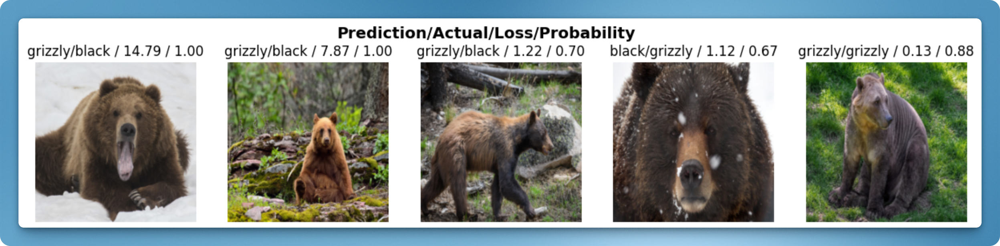

实现一个图像分类功能分几步：

1. 找到已经分类好的的图像数据和模型
2. 使用数据训练模型
3. 使用训练结果对新图片做预测

下面会实现这样的功能：给定一张图片，判断它是灰熊（grizzly bear）、黑熊（black bear）还是泰迪熊（teddy bear）。

在这个领域里 Python 是标准语言，因此下面的实验也使用 Python。我们即将使用 fastai 库，它当前（2025 年 1 月）的 [最新版本](https://pypi.org/project/fastai/2.7.18/) 只支持到 Python 3.10，因此建议使用 Python 3.10。另外，我们会用到 Jupyter Notebook 运行代码。

下面的实验过程中需要访问墙外资源，需要自行解决网络访问问题。

准备好 Python 和网络环境后，预先安装下文需要的 Python 库：

```shell
pip install -U duckduckgo_search fastai notebook
```

然后在终端运行 Notebook 的服务端：

```shell
# 如果你是在 Mac 平台，执行这行 export；其他平台不需要。
export PYTORCH_ENABLE_MPS_FALLBACK=1

# 运行 Notebook 的服务端
jupyter notebook
```

它会自动打开浏览器窗口，进入到 Notebook 的页面中。点击菜单 File => New => Notebook 创建一个新的 Notebook 文件，最终会是这样的界面：



搞定一切后，就可以开始实际的编码了。第一步是搜集相应的图片喂给模型。那么应该如何找到这几种熊的图片呢？

## 找到分类好的图像数据

可以使用搜索引擎来搜索图片。比如在 DuckDuckGo 上 [搜索 grizzly bear](https://duckduckgo.com/?q=grizzly+bear+image&t=h_&iar=images&iax=images&ia=images)：


DuckDuckGo 给出了符合条件的图片。

使用 DuckDuckGo 而不是 Google 的原因是，它有比较开放的 API 接口方便在代码中直接访问。上文已经安装过它的库。搜索一下试试：

```python
from duckduckgo_search import DDGS

DDGS().images('grizzly bear', max_results=2)
```

返回的内容是这样的：

```json
[
  {
    "title": "Grizzly Bear Basic Facts And New Pictures | The Wildlife",
    "image": "http://2.bp.blogspot.com/-NjMTuklENdE/UHzVv_8dIxI/AAAAAAAAA-U/tNBsQDn8kFI/s1600/Grizzly+Bear+Pic.jpg",
    "thumbnail": "https://tse1.mm.bing.net/th?id=OIP.Mw_Mi-jVWv9_0SNTuiGaSQHaE8&pid=Api",
    "url": "http://wildlifeanimalz.blogspot.com/2012/10/Grizzly-Bear.html",
    "height": 1068,
    "width": 1600,
    "source": "Bing"
  },
  {
    "title": "Grizzly Bear | The Canadian Encyclopedia",
    "image": "https://d3d0lqu00lnqvz.cloudfront.net/media/media/897b2e5d-6d4c-40fa-bbe8-6829455747e2.jpg",
    "thumbnail": "https://tse4.mm.bing.net/th?id=OIP.1qjVNM93gpWmEJHUZQVihAHaE8&pid=Api",
    "url": "https://www.thecanadianencyclopedia.ca/en/article/grizzly-bear/",
    "height": 1334,
    "width": 2000,
    "source": "Bing"
  }
]
```

我们只关心其中的 `image` 字段，因此写一个函数来提取它：

```python
def search_images(keywords, max_results=200):
    images = DDGS().images(keywords, max_results=max_results)
    return [img['image'] for img in images]
```

得到了图片 URL 后，还需要把它们下载下来。FastAI 库提供了方便的函数 `download_images` 来下载图片：

```python
from pathlib import Path
from fastai.vision.all import *

# 创建 output 文件夹
dest = Path('output')
dest.mkdir(exist_ok=True)

# 搜索灰熊图片
image_urls = search_images('grizzly bear', max_results=2)

# 下载到 output 文件夹
download_images(dest, urls=image_urls)
```

可以看到 `output` 文件夹中会产生 2 张图片。明白了怎么下载图片后，可以开始下载大量图片，准备喂给模型来训练：

```python
bear_types = ['grizzly', 'black', 'teddy']

path = Path('bears')
if not path.exists():
    path.mkdir()
    for o in bear_types:
        dest = (path/o)
        dest.mkdir(exist_ok=True)
        
        # 每一种熊下载 200 张
        image_urls = search_images(f'{o} bear', max_results=200)
        # 启用 30 个 worker 并发下载，加速下载
        download_images(dest, urls=image_urls, n_workers=30)
```

下载需要一段时间。下载完成后，观察 `bear` 目录中有没有相应的目录和图片文件。有些图片可能没有被下载成功，需要对它们做校验并删除：

```python
file_paths = get_image_files(path)
failed_images = verify_images(file_paths)
failed_images.map(Path.unlink)
```

有了图片后，便可以开始训练模型。

## 使用数据训练模型

在将图片喂给模型做训练之前，仍需要对图片做一些处理。

网上下载的图片动辄有数百万像素，如果将原图给到模型去训练，会非常消耗机器资源和时间，因此业界通用的做法是 **把图片 resize 到 224x224 大小**。

同时为了增加模型的泛化能力，还会 **通过旋转、翻转、裁剪、颜色变换等方式增加训练数据的多样性**。模型一旦认识了同一个物体的多种形态，对它更广泛地理解其他图片也会有帮助。

FastAI 库已经将这些能力集成了进来。比如 [RandomResizedCrop](https://docs.fast.ai/vision.augment.html#randomresizedcrop)，可以将图片进行随机缩放和裁剪。比如这只变换出来的小狗：



再比如 [aug_transforms](https://docs.fast.ai/vision.augment.html#aug_transforms)，会做各种增强变换：



理解完需要对图片做的变换后，还需要理解一个点，即我们需要把数据分成 **训练集和验证集**。训练集用于训练模型，验证集用于调优和评估模型，最终才能好的模型效果。最简单的划分方式是随机划分。FastAI 提供了 [RandomSplitter](https://docs.fast.ai/data.transforms.html#randomsplitter) 来实现此目的。

现在可以开始写代码，把上述逻辑串起来。首先需要产生一个 `DataBlock` 对象：

```python
from fastcore.all import *

data_block = DataBlock(
    # 表示输入数据是图片 (items) 和标签 (y)
    blocks=(ImageBlock, CategoryBlock),
    # 表示如何获取图片文件（使用 get_image_files 获得一个目录下的所有文件的 Path 对象）
    get_items=get_image_files,
    # 表示如何获取标签（使用 parent_label 获取文件的目录名称）
    get_y=parent_label,
    # 表示如何划分数据集（使用 RandomSplitter 随机划分 20% 的数据作为验证集）
    splitter=RandomSplitter(valid_pct=0.2),
    # 表示对输入的图片文件进行预处理（做随机缩放和裁剪）
    item_tfms=RandomResizedCrop(224, min_scale=0.5),
    # 表示如何对批次数据进行预处理（做图片增强）
    batch_tfms=aug_transforms(),
)
```

`DataBlock` 定义了数据处理的逻辑和数据管道。`get_image_files` 和 `parent_label` 都是 FastAI 提供的函数，功能可以看代码注释。有了 `DataBlock` 后，可以让它加载训练数据并产生 dataloaders (dls)：

```python
# path 是上文定义的变量 path = Path('bears')，表示下载下来的图片所在的目录
dls = data_block.dataloaders(path)
```

`dls` 是 `DataLoaders` 的缩写，表示数据加载器的集合，用于管理训练和验证数据集的加载和预处理。你可以用 `dls.train` 和 `dls.valid` 分别来访问训练和验证的数据集（`DataLoader`）。我们尝试展示下训练集的数据，看看 `dls` 对图片做了什么处理：

```python
dls.train.show_batch(max_n=8, nrows=2, unique=True)
```

如果你是在 Jupyter Notebook 上运行，可以看到类似这样的结果：



这是 `dls` 对同一张图片进行增强和变换的结果。

有了 `dls` 后，可以引入 [vision learner](https://docs.fast.ai/vision.learner.html) 来训练模型。这里使用 resnet18，一个流行的图像模型；并使用 learner 的 `fine_tune` 方法来使模型基于我们的熊图片做微调：

```python
learner = vision_learner(dls, resnet18, metrics=error_rate)
learner.fine_tune(4)
```

`fine_tune(4)` 中的参数 4 表示模型微调的周期数（epochs）。在微调过程中，模型将使用预训练的权重（即 resnet18 的），并在新的数据集上进行 4 个周期的训练，以适应新的任务（识别 3 种不同的熊）。这个训练在我的 M4 机器上需要花 1 分钟。

训练完成后，我们需要判断模型识别错误的比例是多少。这两行代码会展示一个 confusion matrix：

```python
interp = ClassificationInterpretation.from_learner(learner)
interp.plot_confusion_matrix()
```



从这个表格可以看出，有 33 只黑熊被模型成功判断，但有 3 只黑熊被模型认成了灰熊（grizzly）。

为了判断是数据集的问题（比如灰熊被错误标记成了黑熊）还是模型的问题（比如模型无法处理不寻常的光线），可以根据它们的 **损失** 对图像进行排序。损失是一个数字，当模型不正确时（尤其是当它对错误答案也很自信时）会更高，或者当模型正确但对其正确答案没有信心时也会更高。可以用 `plot_top_losses` 展示数据集中损失最高的图像：

```python
interp.plot_top_losses(5, nrows=1)
```



可以看到前 2 张图片的 probability 值很高（1.00），表示模型非常确认它们就是灰熊；但训练数据中给的标签却是黑熊，因此 loss 值也很高。从人眼来看，这两张图片中的熊也的确更像灰熊一些。前 4 张图片是模型预测错误的例子；最后一张图片中，模型虽然识别成功了，但它的信心只有 88%，因此 loss 值也相对高些。

对于看起来不合理的数据，可以用 `ImageClassifierCleaner` 来清理它。这里限于篇幅不去深入讲解。

## 使用训练结果对新图片做预测

训练完成后，就可以用模型识别新的图片了。在网上找一张 “teddy bear” 的图片，保存在工程根目录 `bear.png` 中。然后用这样的代码来识别它：

```python
learner.predict('bear.png')
```

返回的结果是：

```
('teddy', tensor(2), tensor([9.7658e-07, 4.0321e-06, 9.9999e-01]))
```

表示模型识别出了它是一只泰迪熊。

## 资源

- [Practical Deep Learning for Coders - Lesson 1](https://course.fast.ai/Lessons/lesson1.html)
- [Fastbook - Chapter 2](https://github.com/fastai/fastbook/blob/master/02_production.ipynb)
