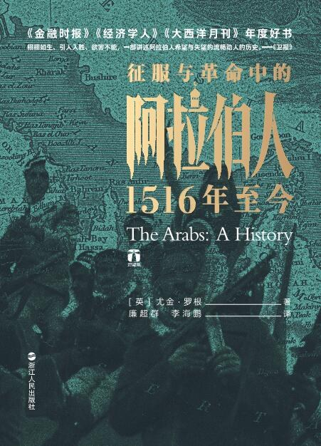
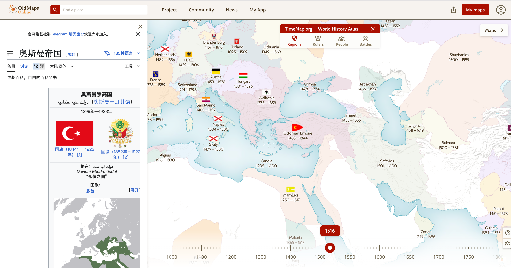

[Susan](https://x.com/feltanimalworld) 在 X 上写到：

<blockquote class="twitter-tweet">
全球化精英的转型：来自我身边的观察…
&mdash; Susan STEM (@feltanimalworld) <a href="https://twitter.com/feltanimalworld/status/1945641166944264501?ref_src=twsrc%5Etfw">July 17, 2025</a></blockquote> 

<blockquote class="twitter-tweet">
没想到关于“全球化精英”的帖子会引发这么多共鸣。  昨天刷到一句话，直击要害：“一切可以用AI验证的白领工作，没有溢价的价值。”这让我想起几年前和一位毕业就去了四大的老同学的一次深聊。那时我就和他说了几个观察：… <a href="https://t.co/RXjIFMamGS">https://t.co/RXjIFMamGS</a>
&mdash; Susan STEM (@feltanimalworld) <a href="https://twitter.com/feltanimalworld/status/1945851479635411093?ref_src=twsrc%5Etfw">July 17, 2025</a></blockquote>

让我有一种模糊的感觉：以后职场上竞争的，可能是看你能熟练地驾驭多少 AI 工作流来为你服务。每一条 AI 工作流，可以被认为是一个聪明的、出活快的实习生；而能熟练使用它们，就像拥有了一个小团队。

Susan 的推文信息密度极大，很多内容我无法完全理解。她让我直观感受到人与人认知的差距，以及我有多少路要走。

随着越来越靠近 35 岁，我在互联网拿高薪的日子也快要到头了。怎样能在有限的金钱和时间限制下给家人更好的生活，变成了一个越来越重要的课题，尤其是在有了一个超可爱的女儿之后。娃暑假回老家之后，晚上的时间空出来了，我也不想浪费，连着几天都跑来荔香公园的自习室自习。

自习室环境很好，灯光明亮安静，也真的有很多人在学习。位置需要在网上预订，基本上会在放出来的一分钟内被订满。旁边就是荔香公园，累了可以在公园走走。

这周重点看了 [Claude with the Anthropic API](https://anthropic.skilljar.com/claude-with-the-anthropic-api) 这个课程。学习它是因为想掌握 AI 时代的基础工具，明白它们能做什么，帮助我扩宽思路。这个课程录得非常好，内容编排没有废话，也带有实践性，比起让我看得昏昏欲睡的官方文档好得不少。

这周的另外一个乐趣是，看了这本《[征服与革命中的阿拉伯人](https://book.douban.com/subject/33408126/)》：

看这本书的契机是最近伊朗与以色列频繁的冲突，让我好奇他们之间的仇恨究竟从何而来，为什么中东在这么多年间一直是全球政治的焦点。看里面的历史事件时，可以结合 [Old Maps Online](https://www.oldmapsonline.org/en/) 网站，观察帝国在不同时期的疆域变化，很有意思：

重新看了次电影《奇异博士》。古一临终前说：

> Death is what gives life meaning.
> 
> To know your days are numbered.
> 
> Your time is short.

珍惜当下。