我的女儿四岁了。看着她慢慢长大，各种能力逐渐增强，我不得不开始思考该给她怎样的教育。最近偶然看到一部纪录片《[他乡的童年](https://movie.douban.com/subject/34807388/)》，讲述记者周轶君走访不同国家，了解各地教育理念的故事。看完几集后对我有所启发，在此记录一下。

## 芬兰

芬兰教育的最大特点是 **高度以学生为中心**。他们不鼓励竞争，秉持着“没有教不好的孩子，只有不会因材施教的老师”这样的理念。在小学阶段，他们几乎不进行正式的考试。

孩子们可以奇装异服：

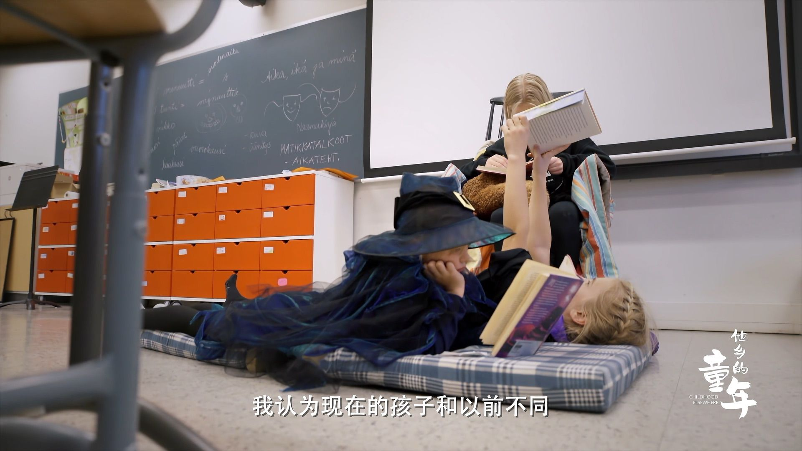

也可以按自己舒服的方式阅读：

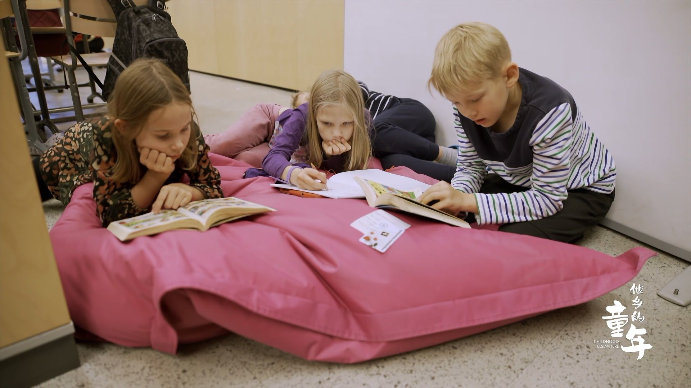

让我最羡慕的是，他们时常可以去户外上课。芬兰有着大片的森林🪵，学校会组织大家在自然中学习：

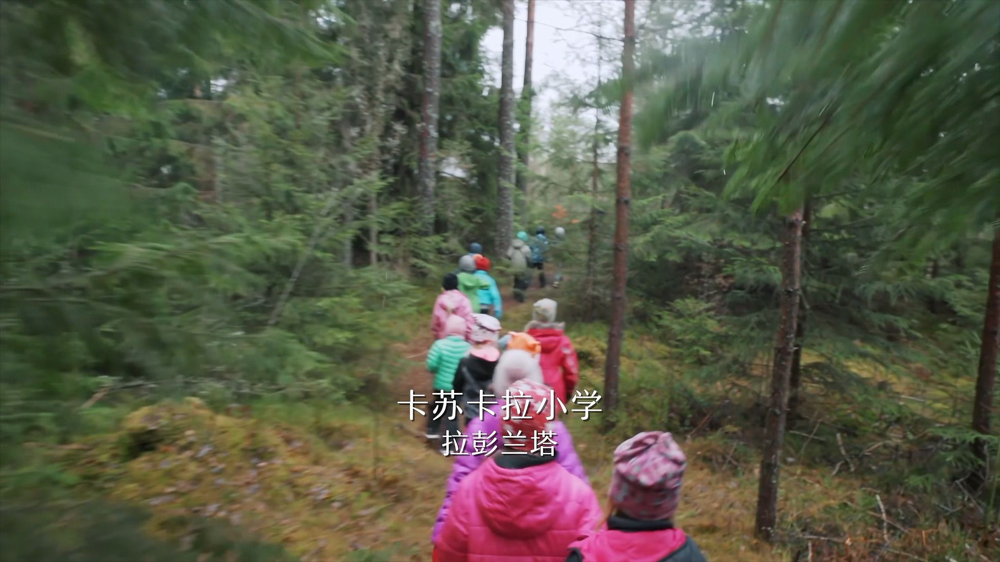

老师给每个人发了一张色卡，要求他们去收集不同颜色的材料：

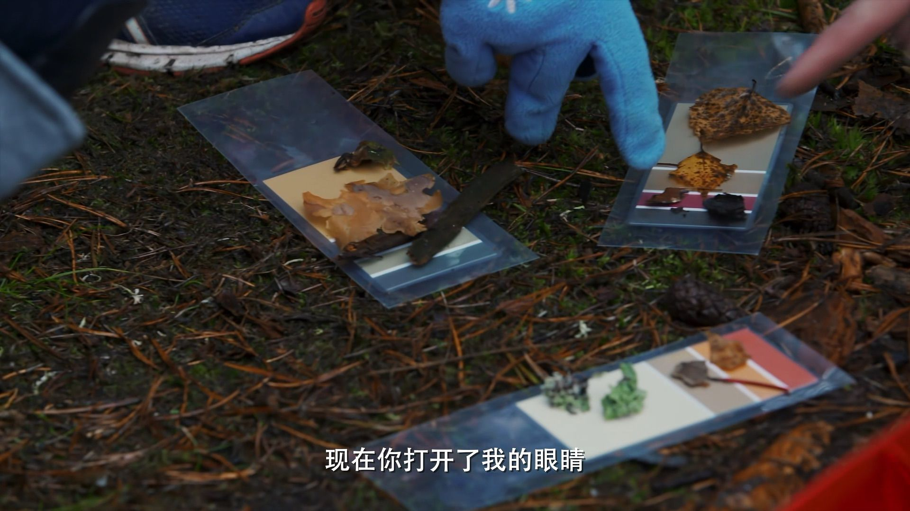

去品尝大自然的味道：

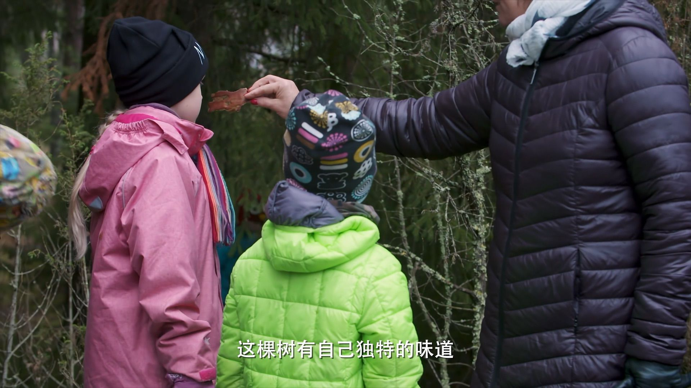

还有这个手工课程，背景是你的飞机坠落在荒岛上，需要搭一个帐篷来生存。孩子们用不同材料搭出了很有创意的作品：

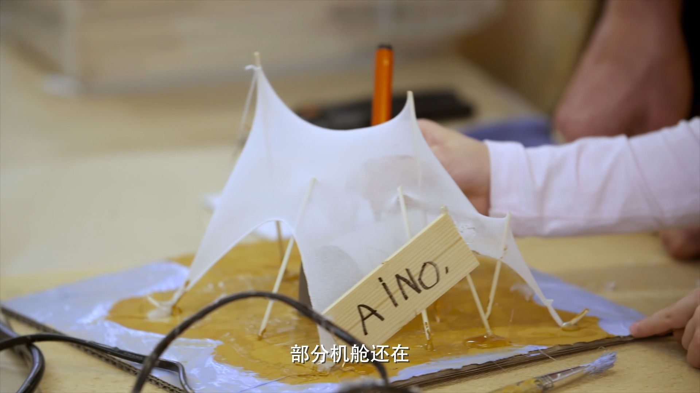

他们还组织小朋友到养老院，跟老人一起画画、交流，以提升他们对社会的责任感：

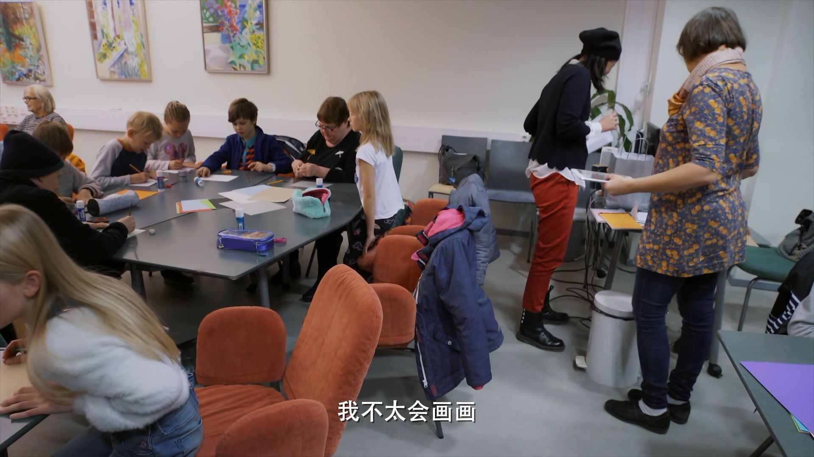

我从小到大所经历的教育，都给我留下了死板和无趣的印象。我很难接受女儿也要经历同样糟糕的学习体验。相比之下，芬兰的教育模式更接近我的理想。在那里，社会充分尊重孩子的个性，不过分强调成绩，强调平等互重。高福利的社会环境也让学校能够设计出丰富有趣的课程。以我女儿活泼好动又充满好奇心的性格，应该会很享受这样的学习环境。

最近女儿幼儿园举办散学典礼，每个孩子都收到了奖状。虽然人人有份，但我还是注意到奖状内容的细微差异。我家这个调皮捣蛋的小家伙，在班里算不上传统意义上的 “好学生“，她的奖状上写的是“进步之星“。其他孩子则是 “优秀宝贝“、“可爱宝贝“、“阅读小达人“之类的称号。即便我们的社会在试图减少竞争，骨子里还是想要保留着评价体系。

当然，纪录片难免会带有一定的理想化色彩。在豆瓣上就有网友分享她孩子在芬兰的真实学习体验，表示 [实际情况并不如片中展现的那般美好](https://movie.douban.com/subject/34807388/discussion/637448629/)。"老师并非都那么善解人意，这样的好老师在哪里都是稀缺的。"这一点我很认同。即使是真心喜欢孩子的老师，每天面对几十个小朋友，也很难始终保持高涨的热情。

回想我的初高中时期，学习强度并不高，我主要靠自学。我不希望女儿将来处在高压的学习环境中，那只会过早地消磨掉她的好奇心和学习热情。希望等她真正开始求学时，我能有足够的能力帮她避开无意义的内卷，让她有更多机会培养各方面的能力，找到自己真正热爱的事物。

## 印度

你是否好奇为什么全球大型科技公司中印度高管的比例如此之高？这或许与他们独特的求学方式有关。

印度跟中国非常不一样的点是，它不认为问题需要有一个标准答案，认为学校应该提供一个从多角度探讨问题的环境，甚至挑战老师也被是被推崇的：

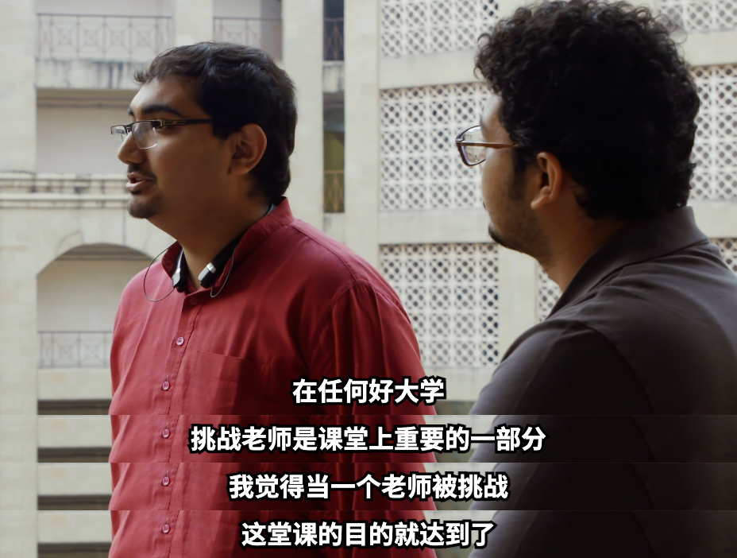

片子里面提到一点，印度的课堂上经常有大量的讨论。印度学生热衷讨论，即使他的观点和思考都还不成熟，也仍然愿意把观点表达出来。感受下这段对话：

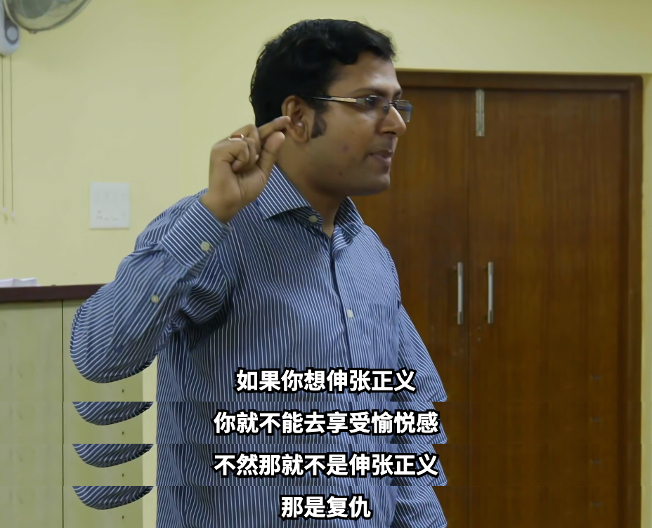

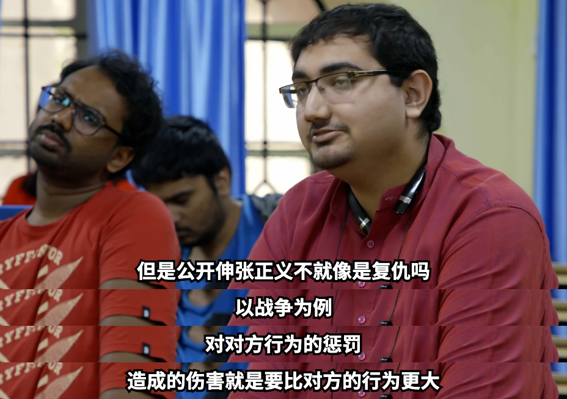

一样是人口大国，为什么我们会比印度更崇尚标准答案呢？

上面的例子是在大城市里的好学校。下面的故事是在一个穷困的乡村里。这里没有钱造好的学校，也没有钱请老师，他们想到的办法是利用网络来学习。小朋友们围坐在电脑前，每天都有志愿者远程给他们授课：

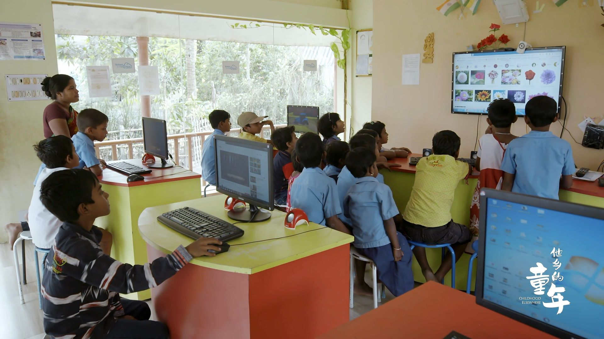

这样贫困的农村地区，他们的家长甚至连能联网的手机都没有，小孩子能接触的教育资源也少之又少。像这样一个互联网学校，甚至连网络都是一个难解的问题。但多亏了互联网，孩子们有了一扇看见世界的窗户。它们叫这个作「自我组织的学习环境」。

在我成长的年代，娱乐和学习资源都很匮乏。我依然记得小学时的暑假，整整两个月只能在家看电视，无聊到甚至期待开学。而现在的孩子们拥有太多娱乐方式。我担心在这样的环境下，孩子们很难对某件事物产生持久的好奇心和热情。当周围充斥着各种有趣的事物时，要让他们愿意在某件事情上深入投入，确实是个不小的挑战。如何引导孩子向好的方向发展，可能是我们这一代家长共同面临的难题。
