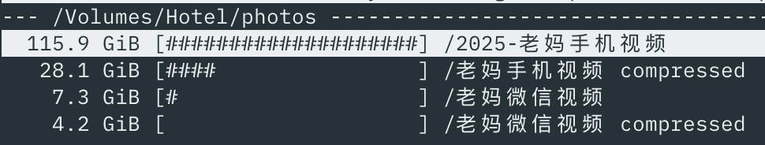

老妈旧手机空间不足。我买了台新的 vivo x200s，需要把旧机的照片搬过去。

老人家的照片主要有两个渠道：

- 自己手机拍的占绝大多数；自动同步到华为云空间
- 微信接收的
- 更早前的手机或者相机拍的，存在华为云空间中

考虑到老人因为手机空间不足已经删掉了一部分视频，因此华为云空间中的照片是最全的。于是我决定从华为那把所有照片视频下载下来。目标是最终都同步到 Google Photos。

## 从华为云空间下载

遇到的第一个麻烦是，华为云空间只有 Windows 客户端，没有 Mac 的。虽然有网页版，但一次只能下载 500 张，我要是操作完所有照片腱鞘炎一定不会放过我。好在我家里有 Mac Mini 也有 Windows 台式机，于是把台式机开了起来。

云空间的客户端上可以一次性下载所有照片视频，而且带宽给得非常足，可以跑满我家的千兆带宽，下载速度到 100MB/s。但第一个坑出现了。我把下载路径选在一个机械硬盘上，它的写入速度成了瓶颈，只能在 40MB/s 的速度。而且下载了 70G 后硬盘居然掉了（怀疑是过热），这个 D 盘直接从我的电脑中消失，下载也被中断了。

重启电脑后硬盘回来了。但华为这个垃圾云空间又开始搞事，刚才的下载任务不见了，我必须全选照片重新下载。选了同个下载路径后，没想到已经下载好的 70G 它不认了，也需要重新下载！而且还给我搞出一堆重复的文件来。比如 `IMG_123456.jpg`, `IMG_123456(1).jpg`，后者是因为重新下载时因为有重名而自动加的 `(1)` 后缀。妈呀你就不能算个 hash 再决定要不要重新下载吗。

郁闷的我换了策略，不再下载到机械硬盘了，而是把照片和视频分开下载到固态硬盘中。用了固态硬盘后下载速度起飞，到 100MB/s，重新下载前面 70G 也不是特别花时间。下载好后就开始解决第二个问题：压缩文件大小。

## 压缩照片大小

图片和视频的压缩是不一样的。图片领域有很多工具，可以在基本不影响效果的情况下去做压缩。MacOS 上可以用 [ImageOptim](https://imageoptim.com/mac) (免费)、[PhotoBulk](https://photobulkeditor.com/) (收费)，Windows 上可以用 [RIOT](https://riot-optimizer.com/)。它们的原理都是类似的，使用多个开源的压缩工具（如 jpegoptim, jpegtran）来做压缩，然后使用体积最小的结果。它们也都可以实现 in-place 替换，即将压缩结果替换掉原文件。因为是在 Windows 上操作，我这次使用的是 RIOT。压缩后效果显著，降了一半左右的空间。

另外要注意的是，这些软件往往有移除元信息（EXIF）的功能。建议把这些功能关掉。一方面备份照片并不需要担心隐私泄露（如果你不介意 Google 扫描这些）；另一方面里面有拍摄地点等信息，上传到 Google Photos 后可以很方便地根据位置来筛选图片。

## 压缩视频大小

视频的压缩，我直接在 GitHub Copilot 上问了 GPT-5 怎么做好。它给的意见是：

- 视频封装成 H.265 格式
- 如果码率过高降低码率

然后它给我生成了一个脚本，放在文章末尾了。跑这个脚本的结果是直接砍了 70% 的体积：



## 元信息混乱

除了上面提到的图片元信息的保留，视频文件也存在元信息。我让 Copilot 生成的脚本中需要保留元信息，于是它给我加了 `-map_metadata` 参数，理论上应该是 OK 的。当我把处理完的视频传到 Google Photos 后，我惊奇地发现，里面多出一堆日期为今天的视频。这显然是不对的，这些视频没有一个是今天拍的。但也并不是全部视频文件都有这个问题。

做了一番研究后，我发现可以用 `mdls` 命令看视频文件的元信息：

```
# 日期正常的文件
> mdls IMG_0431.MOV
kMDItemFSContentChangeDate = 2022-07-03 09:37:17 +0000  # 22 年拍的，是对的
kMDItemFSCreationDate      = 2025-09-09 12:57:05 +0000

# 日期不正常的文件
> mdls a66066972088aeaa5d08e2be3c022275.mp4
kMDItemFSContentChangeDate = 2025-09-09 13:25:13 +0000  # 并不是 25 年拍的
kMDItemFSCreationDate      = 2025-09-09 13:25:13 +0000
```

Google Photos 取的应该是 `kMDItemFSContentChangeDate` 这个字段作为其拍摄日期。

再研究了一下，发现从微信 Mac 版中提取的视频，它的这个日期全都是错的，不是拍摄日期而是文件生成的日期。这又讲回到我是怎样同步微信中的视频的。我将手机微信中的聊天纪录一次性迁移到微信 Mac 版，然后就可以在这个路径捞到所有的视频文件：

```
~/Library/Containers/com.tencent.xinWeChat/Data/Documents/xwechat_files/{wechat-id}/msg/video
```

但显然微信并没有把元信息保留下来。

如果是长时间有使用 Mac 微信，那么不存在这个问题，相关的视频应该在接收到它的当天就被下载下来，因此与拍摄时间的差异不会太大。但是像我这种一次性从手机导入的，时间就错得离谱，失去了参考价值。

## 那微信上的视频还要吗？

对于我这样有信息洁癖的人来说，微信中的视频时间跨度很长，让它们都挤在 Google Photos 上的同一天，是我无法接受的。这也会影响 Google 的算法对一些内容的生成，比如它会时不时给你推送小孩不同年龄的对比照片。如果时间线错乱影响到了这些能力就有点不必要。于是我先把这些视频从 Google Photos 上移除了。

## 分析微信上的视频来源

移除之后，我还是想分析一下这些视频的价值。这些视频有两类：

- 自己发给别人的，这些已经包含在上面云空间的内容中，无需重复备份
- 别人发来的

我试用了几个重复视频分析器，用来分析微信的视频与手机的视频有多少是重复的。试了这两个 Mac 软件：

- [Gemini 2](https://apps.apple.com/us/app/gemini-2-the-duplicate-finder/id1090488118?mt=12)：做 Clean My Mac 和 Setapp 的 Macpaw 公司出的，但实际效果不佳，只把文件完全一样的找出来了；而且收费不便宜
- [Video simili duplicate cleaner](https://apps.apple.com/ie/app/video-simili-duplicate-cleaner/id1557271308?mt=12)：效果很好，找出了几百个重复；而且一次性买断，才 58 块钱

除去重复的视频后，还是剩下挺多别人发来的视频。

## 给这些视频一个近似的时间

这时我想到，这些视频在微信的目录中，是带有一个月份的。它的目录结构像这样：

```
Library/Containers/com.tencent.xinWeChat/Data/Documents/xwechat_files/{wx_id}/msg/video
 |- 2025-09
     |- 74f4726202c1a826ca02f25a3857d0ba.mp4
 |- 2025-08
     |- 5f167fdf4f2ea7c405e80a151bf8a3ef_raw.mp4
```

有了月份，这些视频就有一个近似的时间。我又让 Copilot 帮我写了段 Python 脚本，读取目录所表示的月份，作为拍摄日期写入视频文件中。这个时间虽然不是很精确，但是也足够了。这个脚本也附在下面。

至此，备份的任务已经完成。

## 压缩视频的脚本

脚本是在 MacOS 上运行的，需要先安装 ffmpeg：

```bash
#!/usr/bin/env zsh
# 批量无(必要)重编码/智能重编码手机视频脚本
# 支持输入：*.mp4 *.MP4 *.mov *.MOV *.3gp *.3GP
# 目标：在保持主观画质前提下，最大化减小体积。
# 平台：macOS (zsh)
# 依赖：ffmpeg ffprobe (建议 `brew install ffmpeg` 安装完整版)
# 可选：md5 (系统自带) 或 md5sum
# 日志：compressed/convert_log.csv

set -u

############################################
# 可调参数（也可通过命令行覆盖）
############################################
# 默认编码方式：hardware|software  (hardware 使用 hevc_videotoolbox)
ENCODER_MODE="hardware"
# 软件 x265 CRF（数值小=质量高=文件大）
X265_CRF=26
X265_PRESET="medium"  # medium / slow / slower
# 硬件 HEVC 质量参数 (0-100 越低越好)，建议 45~55 之间
VT_QUALITY=50
# 仅当分辨率超过此高度才降到该高度 (0 表示不降)。例如 1080
MAX_HEIGHT=0
# 是否限制输出最大帧率 (0 表示保持原始)。例如 30
MAX_FPS=0
# 是否干跑（只打印计划，不真正执行） true|false
DRY_RUN=false
# 是否生成 MD5 校验（耗时） true|false
DO_MD5=false
# 已是 HEVC 时，按分辨率决定的码率阈值 (bps) 低于则直接 copy
THRESH_720=3000000      # 3 Mbps
THRESH_1080=8000000     # 8 Mbps
THRESH_2160=40000000    # 40 Mbps
# 目标目录
OUT_DIR="compressed"
# 是否覆盖已存在输出文件 true|false
OVERWRITE=false
# 保留原文件修改时间戳（touch -r） true|false
KEEP_MTIME=true

############################################
usage() {
  cat <<EOF
用法: $0 [选项]

选项:
  -m hardware|software   选择编码模式 (默认: hardware)
  -c <crf>               x265 CRF (软件模式时有效, 默认: ${X265_CRF})
  -p <preset>            x265 预设 (默认: ${X265_PRESET})
  -q <qval>              硬件 hevc_videotoolbox 质量值 (默认: ${VT_QUALITY})
  -H <height>            限制最大高度 (0=不变, 默认: ${MAX_HEIGHT})
  -F <fps>               限制最大帧率 (0=不变, 默认: ${MAX_FPS})
  -o <dir>               输出目录 (默认: ${OUT_DIR})
  -n                     Dry-run 仅显示计划
  -O                     允许覆盖已存在输出文件
  -M                     生成 MD5 校验
  -h                     显示本帮助

示例:
  # 快速批量（硬件 HEVC）
  $0 -m hardware -q 48
  # 精细压缩（软件 x265）
  $0 -m software -c 25 -p slow
  # 限制最高 1080p 和 30fps
  $0 -H 1080 -F 30
EOF
}

while getopts ":m:c:p:q:H:F:o:nOMh" opt; do
  case $opt in
    m) ENCODER_MODE=$OPTARG ;;
    c) X265_CRF=$OPTARG ;;
    p) X265_PRESET=$OPTARG ;;
    q) VT_QUALITY=$OPTARG ;;
    H) MAX_HEIGHT=$OPTARG ;;
    F) MAX_FPS=$OPTARG ;;
    o) OUT_DIR=$OPTARG ;;
    n) DRY_RUN=true ;;
    O) OVERWRITE=true ;;
    M) DO_MD5=true ;;
    h) usage; exit 0 ;;
    *) echo "未知参数: -$OPTARG" >&2; usage; exit 1 ;;
  esac
done

command -v ffmpeg >/dev/null 2>&1 || { echo "需要 ffmpeg" >&2; exit 2; }
command -v ffprobe >/dev/null 2>&1 || { echo "需要 ffprobe" >&2; exit 2; }

mkdir -p "$OUT_DIR"
LOG="$OUT_DIR/convert_log.csv"
if [ ! -f "$LOG" ]; then
  echo "source,action,orig_MB,new_MB,save_pct,codec_in,width,height,bitrate_in,encoder_used,params,elapsed_s" > "$LOG"
fi

ts() { date +%s; }

human_size_MB() { # bytes -> MB 整数
  echo $(( $1 / 1024 / 1024 ))
}

pick_threshold() {
  local h=$1
  if (( h <= 800 )); then echo $THRESH_720; return; fi
  if (( h <= 1300 )); then echo $THRESH_1080; return; fi
  echo $THRESH_2160
}

calc_scale_filter() {
  local h=$1
  local vf=""
  if (( MAX_HEIGHT > 0 && h > MAX_HEIGHT )); then
    vf="scale=-2:${MAX_HEIGHT}"
  fi
  if (( MAX_FPS > 0 )); then
    if [ -n "$vf" ]; then
      vf="${vf},fps=${MAX_FPS}"
    else
      vf="fps=${MAX_FPS}"
    fi
  fi
  echo $vf
}

compute_md5() {
  local f=$1
  if command -v md5 >/dev/null 2>&1; then md5 -r "$f" | awk '{print $1}';
  elif command -v md5sum >/dev/null 2>&1; then md5sum "$f" | awk '{print $1}';
  else echo "NO_MD5_TOOL"; fi
}

process_file() {
  local f="$1"
  local base="${f##*/}"
  local name="${base%.*}"
  local extlower="${f##*.}"; extlower="${extlower:l}"  # zsh: to lower
  case $extlower in
    mp4|mov|3gp) : ;;
    *) return ;;
  esac

  local out="$OUT_DIR/${name}.mp4"
  if [ -f "$out" ] && ! $OVERWRITE; then
    echo "跳过(已存在): $out"
    return
  fi

  # ffprobe 取信息
  local info
  info=$(ffprobe -v error -select_streams v:0 -show_entries stream=codec_name,width,height,bit_rate -of default=nk=1:nw=1 "$f") || { echo "获取信息失败: $f"; return; }
  local codec width height bitrate
  codec=$(echo "$info" | sed -n '1p')
  width=$(echo "$info" | sed -n '2p')
  height=$(echo "$info" | sed -n '3p')
  bitrate=$(echo "$info" | sed -n '4p')
  [ -z "$bitrate" ] && bitrate=0

  local thresh=$(pick_threshold "$height")
  local action="reencode"
  local encoder_used params cmd_v cmd_a

  # 判定是否可直接封装复制
  if [ "$codec" = "hevc" ] && [ "$extlower" != "3gp" ] && [ "$bitrate" -gt 0 ] && [ "$bitrate" -lt "$thresh" ] && (( MAX_HEIGHT == 0 || height <= MAX_HEIGHT )) && (( MAX_FPS == 0 )); then
    action="copy"
  fi

  local vf=""; vf=$(calc_scale_filter "$height")

  if [ "$action" = "copy" ]; then
    cmd_v="-c:v copy"; cmd_a="-c:a copy"; encoder_used="copy"; params="-"
  else
    if [ "$ENCODER_MODE" = "software" ]; then
      encoder_used="libx265"
      cmd_v=( -c:v libx265 -preset "$X265_PRESET" -crf "$X265_CRF" -x265-params high-tier=1 )
      params="crf=$X265_CRF;preset=$X265_PRESET"
    else
      encoder_used="hevc_videotoolbox"
      cmd_v=( -c:v hevc_videotoolbox -q:v "$VT_QUALITY" )
      params="q=$VT_QUALITY"
    fi
    cmd_a=( -c:a aac -b:a 128k )
  fi

  local vf_part=()
  if [ -n "$vf" ]; then vf_part=( -vf "$vf" ); fi

  local orig_size=$(stat -f%z "$f")
  local t0=$(ts)

  if $DRY_RUN; then
    echo "[计划] $f -> $out | $action | codec_in=$codec ${width}x${height} br=${bitrate} thresh=${thresh} encoder=${encoder_used} ${params} vf='${vf}'"
    return
  fi

  if [ "$action" = "copy" ]; then
    # 复制模式仍显式复制全局元数据；use_metadata_tags 尝试保留更多标签名称
    ffmpeg -y -i "$f" -map 0 -map_metadata 0 -c copy -movflags +faststart+use_metadata_tags "$out" >/dev/null 2>&1 || { echo "复制失败: $f"; return; }
  else
    # 重编码：-map 0 保留所有可用流（视频/音频/字幕/附加元数据流），如不需要可去掉
    ffmpeg -y -i "$f" -map 0 ${vf_part[@]} ${cmd_v[@]} ${cmd_a[@]} -map_metadata 0 -movflags +faststart+use_metadata_tags "$out" >/dev/null 2>&1 || { echo "编码失败: $f"; return; }
  fi

  # 保留原文件修改时间（类似照片的时间线），方便按时间排序
  if $KEEP_MTIME && [ -f "$out" ]; then
    touch -r "$f" "$out" 2>/dev/null || true
  fi

  local t1=$(ts)
  local new_size=$(stat -f%z "$out" 2>/dev/null || echo 0)
  local orig_MB=$(human_size_MB $orig_size)
  local new_MB=$(human_size_MB $new_size)
  local save_pct=0
  if [ $orig_size -gt 0 ]; then
    save_pct=$(( (orig_size - new_size) * 100 / orig_size ))
  fi
  local elapsed=$(( t1 - t0 ))
  echo "$f,$action,$orig_MB,$new_MB,$save_pct,$codec,$width,$height,$bitrate,$encoder_used,$params,$elapsed" >> "$LOG"

  if $DO_MD5; then
    local md5o=$(compute_md5 "$f")
    local md5n=$(compute_md5 "$out")
    echo "MD5 原: $md5o 新: $md5n ($out)"
  fi
  echo "完成: $f -> $out (节省 ${save_pct}%)"
}

shopt_nullglob() { :; }  # 占位（zsh 不需要）

main() {
  local count=0
  for f in *(.N); do
    case "${f##*.}" in
      mp4|MP4|mov|MOV|3gp|3GP) process_file "$f"; count=$((count+1));;
    esac
  done
  echo "处理完成: ${count} 个文件。日志: $LOG"
  if $DRY_RUN; then echo "(Dry-run 模式未实际生成文件)"; fi
}

main "$@"
```

## 给微信视频设置近似时间的脚本

```python
#!/usr/bin/env python3
"""
Set WeChat video file dates based on their source YYYY-MM folders.

- Scans the source root for subfolders named YYYY-MM (e.g. 2024-01).
- Builds a mapping: filename -> YYYY-MM (earliest month wins if duplicates exist).
- For each matching file in the target directory, sets the file's mtime (content modification time)
  to "YYYY-MM-01 00:00:00 +0000" (UTC). On macOS, mdls shows this as kMDItemFSContentChangeDate.

Notes:
- This updates the POSIX mtime via os.utime; creation date is not modified.
- Run with --dry-run first to preview changes.

Example:
  python3 wechat_video_date_fix.py \
    --source-root /Users/onlyice/Library/Containers/com.tencent.xinWeChat/Data/Documents/xwechat_files/{your-wxid}/msg/video \
    --target-dir . \
    --dry-run
"""
from __future__ import annotations

import argparse
import os
import re
import sys
from datetime import datetime, timezone
from typing import Dict, Tuple

# Video extensions to consider (lowercase)
VIDEO_EXTS = {".mp4", ".mov", ".m4v", ".3gp", ".avi", ".mkv"}

YM_RE = re.compile(r"^(?P<y>\d{4})-(?P<m>0[1-9]|1[0-2])$")


def is_video_file(name: str) -> bool:
    _, ext = os.path.splitext(name)
    return ext.lower() in VIDEO_EXTS


def parse_args() -> argparse.Namespace:
    parser = argparse.ArgumentParser(description="Set file mtime based on source YYYY-MM folders")
    parser.add_argument(
        "--source-root",
        default=(
            "/Users/onlyice/Library/Containers/com.tencent.xinWeChat/Data/Documents/"
            "xwechat_files/{your-wxid}/msg/video"
        ),
        help="Path to the root folder containing YYYY-MM subfolders",
    )
    parser.add_argument(
        "--target-dir",
        default=".",
        help="Directory where files without YYYY-MM structure live (default: current dir)",
    )
    parser.add_argument(
        "--dry-run",
        action="store_true",
        help="Only print what would change without modifying files",
    )
    parser.add_argument(
        "--prefer-latest",
        action="store_true",
        help="If a filename exists in multiple months, prefer the latest month (default: earliest)",
    )
    return parser.parse_args()


def ym_key(ym: str) -> Tuple[int, int]:
    m = YM_RE.match(ym)
    if not m:
        raise ValueError(f"Invalid YYYY-MM folder name: {ym}")
    return int(m.group("y")), int(m.group("m"))


def build_mapping(source_root: str, prefer_latest: bool) -> Dict[str, str]:
    mapping: Dict[str, str] = {}
    try:
        entries = sorted(os.listdir(source_root))
    except FileNotFoundError:
        print(f"[ERROR] Source root not found: {source_root}", file=sys.stderr)
        sys.exit(1)

    ym_dirs = [d for d in entries if YM_RE.match(d) and os.path.isdir(os.path.join(source_root, d))]
    if not ym_dirs:
        print(f"[WARN] No YYYY-MM folders found under: {source_root}")

    for ym in sorted(ym_dirs):
        ym_path = os.path.join(source_root, ym)
        try:
            for name in os.listdir(ym_path):
                src = os.path.join(ym_path, name)
                if not os.path.isfile(src):
                    continue
                if not is_video_file(name):
                    continue

                if name not in mapping:
                    mapping[name] = ym
                else:
                    # Resolve duplicates per flag
                    y1, m1 = ym_key(mapping[name])
                    y2, m2 = ym_key(ym)
                    if prefer_latest:
                        if (y2, m2) > (y1, m1):
                            mapping[name] = ym
                    else:
                        if (y2, m2) < (y1, m1):
                            mapping[name] = ym
        except PermissionError:
            print(f"[WARN] Skipping (permission denied): {ym_path}")

    print(f"[INFO] Built mapping for {len(mapping)} filenames from {len(ym_dirs)} month folders.")
    return mapping


def month_start_utc_ts(ym: str) -> float:
    y, m = ym_key(ym)
    dt = datetime(y, m, 1, 0, 0, 0, tzinfo=timezone.utc)
    return dt.timestamp()


def apply_dates(target_dir: str, mapping: Dict[str, str], dry_run: bool):
    changed = 0
    skipped_missing = 0
    examined = 0

    try:
        for name in os.listdir(target_dir):
            path = os.path.join(target_dir, name)
            if not os.path.isfile(path):
                continue
            if not is_video_file(name):
                continue
            examined += 1

            ym = mapping.get(name)
            if not ym:
                skipped_missing += 1
                print(f"[SKIP] No month found for: {name}")
                continue

            ts = month_start_utc_ts(ym)
            if dry_run:
                print(f"[DRY] Would set {name} -> {ym}-01 00:00:00 +0000")
            else:
                try:
                    os.utime(path, (ts, ts))  # atime, mtime
                    changed += 1
                    print(f"[OK] Set {name} -> {ym}-01 00:00:00 +0000")
                except PermissionError:
                    print(f"[ERROR] Permission denied setting time for: {name}")
                except FileNotFoundError:
                    print(f"[ERROR] File disappeared while processing: {name}")
    except FileNotFoundError:
        print(f"[ERROR] Target dir not found: {target_dir}", file=sys.stderr)
        sys.exit(1)

    return changed, skipped_missing, examined


def main() -> None:
    args = parse_args()

    source_root = os.path.abspath(os.path.expanduser(args.source_root))
    target_dir = os.path.abspath(os.path.expanduser(args.target_dir))

    print(f"[INFO] Source root: {source_root}")
    print(f"[INFO] Target dir : {target_dir}")
    print(f"[INFO] Mode       : {'DRY-RUN' if args.dry_run else 'APPLY'}")
    print(f"[INFO] Duplicate policy: {'latest' if args.prefer_latest else 'earliest'}")

    mapping = build_mapping(source_root, args.prefer_latest)
    changed, skipped_missing, examined = apply_dates(target_dir, mapping, args.dry_run)

    print("\n[SUMMARY]")
    print(f" Examined target files: {examined}")
    print(f" Updated timestamps  : {changed}")
    print(f" Missing in mapping  : {skipped_missing}")

    if args.dry_run:
        print("\nRun again without --dry-run to apply the changes.")
    else:
        print("\nTip: If mdls still shows stale metadata, force reindex the target folder:")
        print(f" mdimport -f '{target_dir}'")


if __name__ == "__main__":
    main()
```