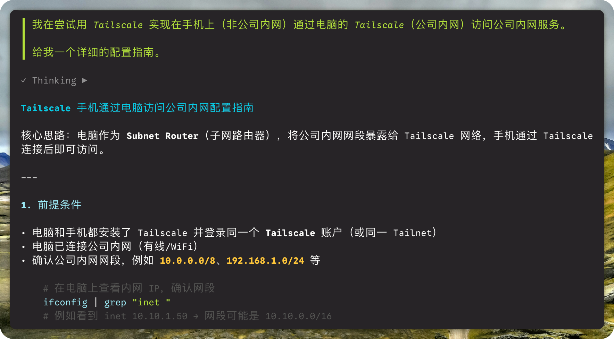
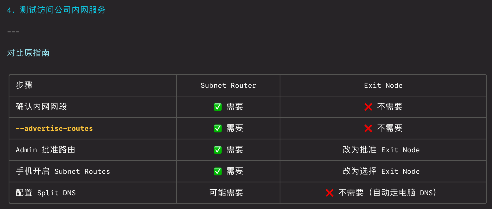
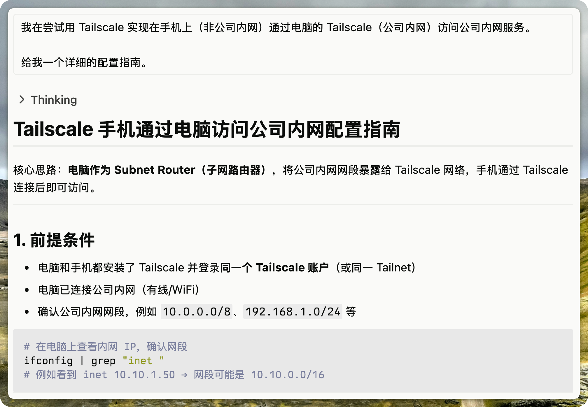

最近两天，我一直在试用一款叫 [AMP Code](https://ampcode.com/) 的 CLI 编程助手。本来只是抱着随便看看的心态，没想到用下来之后，真的有被惊艳到。

## 第一印象：干净、直觉化的 CLI

打开终端敲下第一条指令，AMP Code 给我的第一感觉就是——干净。相比 Claude Code 和 Codex，它的输出排版像是在终端里直接渲染了 Markdown：标题、列表、加粗一应俱全，代码片段甚至带有语法高亮。

还有一个很小但很贴心的细节：模型的 Thinking 部分右侧有一个 ▷ 符号，点一下就能展开看推理过程。Claude Code 要 Ctrl+O 才能看到所有 thinking block，体验上差了不少。

表格的渲染也很精致，支持 Emoji、中英文混排，有清晰的网格线和表头区分，在终端里看着赏心悦目：

## 会话分享：一键生成链接

AMP Code 还有一个让我觉得很方便的功能：它可以把对话内容同步到官方服务器，在官网的 Thread 页面里直接查看。想把一个调试过程分享给同事？复制链接就行了。

当然，数据隐私性是另一个话题了。但对于日常开发中快速分享上下文来说，这个功能确实省心。

## 真正重要的：它能解决问题

花哨的 UI 终归是锦上添花，工具好不好用，最终还是看它能不能帮你把活干了。我拿了两个实际场景来测试：

1. **通过 Chrome DevTools MCP 修改一个复杂的网页表单数据** —— 涉及多层嵌套的表单结构，手动改起来非常繁琐
2. **使用 Tailscale 做内网穿透** —— 需要理解网络拓扑和路由配置

两个场景它都简洁高效地解决了。尤其是第二个场景，我还特意拿同样的问题去问了 Claude 网页版，结果效果竟然不如 AMP Code 在终端里的表现。

## 值得一试

如果你也在寻找一个顺手的 CLI 编程助手，强烈推荐试试 AMP Code。更何况，它目前还提供持续的免费额度，试错成本几乎为零。
